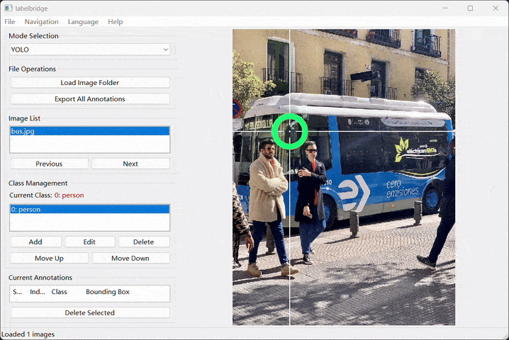
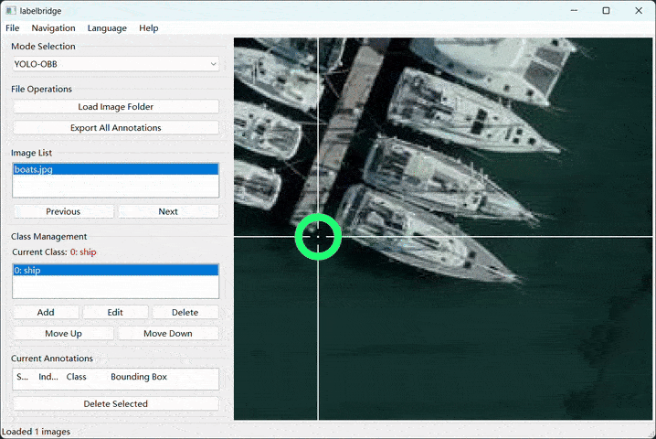

# **LabelBridge – A Lightweight YOLO / YOLO-OBB Annotation Tool (wxPython)**

English | [简体中文](README_zh.md)

---

## 🚀 Overview

**LabelBridge** is a clean, lightweight, and easy-to-use image annotation tool built with **wxPython**.
It supports both **YOLO** and **YOLO-OBB (oriented bounding box)** formats and is optimized for smooth image navigation,
class management, and annotation operations.

This tool is designed to be simple, fast, and intuitive. No complicated installation, no heavy dependencies.

---

## ✨ Features

* ✔️ Supports **YOLO** and **YOLO-OBB** annotation formats
* ✔️ Smooth image browsing with keyboard shortcuts
* ✔️ Fast bounding box drawing, editing, and deleting
* ✔️ Class list management: add, edit, delete, reorder

---

## 📦 Installation

### **1. Install requirements**

```
pip install wxPython numpy
```

### **2. Run the tool**

```
python labelbridge.py
```

---

## 🖼️ Usage

### 1. Load Image Folder

Click **Load Folder** to import a directory of images (`.jpg`, `.png`, etc.).
> If corresponding `.txt` annotation files exist, they will be loaded automatically.

### 2. Class Management

Use the left panel to:

- **Add** new classes
- **Edit** or **delete** existing ones
- **Reorder** the class list

> Changing the order updates class IDs in all annotation files automatically.

### 3. Select Current Class

Click any class in the list to set it as the active label for new annotations.

### 4. Image Annotation

#### • Normal Rectangle (YOLO mode)

- **Create**: Left-click + drag
- **Select**: Click an existing box
- **Move**: Drag the selected box
- **Resize**: Drag the corner/edge handles



#### • Rotated Rectangle (YOLO-OBB mode)

- **Create**: Left-click + drag (initially horizontal)
- **Rotate**:
    - **Right-click + drag (recommended)**: Adjust the crosshair angle in real time
    - **Z / X / C / V keys**: Also adjust the crosshair angle
- All other operations (move, resize, select) work the same as YOLO mode



### 5. Image Navigation

- **← / → Arrow keys**: Previous / next image
- **Image list**: Click any thumbnail to jump directly

### 6. Annotation Editing

- **Delete key**: Remove the selected annotation
- **ESC key**: Deselect current box

### 7. Pan & Zoom

- **Middle-click + drag**: Pan the image
- **Ctrl + Mouse Wheel**: Zoom in/out centered on cursor

### 8. Save Annotations

- **Auto-save**: Annotations are saved automatically when switching images
- **Manual export**: Click the **Export All** button to force save all files and generate `classes.txt`

---

## ⌨️ Keyboard Shortcuts

| Key             | Action           |
|-----------------|------------------|
| **Ctrl + O**    | Open folder      |
| **Ctrl + S**    | Save annotations |
| **Left Arrow**  | Previous image   |
| **Right Arrow** | Next image       |
| **Ctrl + Q**    | Quit             |

---

## 🤝 Contributing

Contributions are welcome!
Feel free to submit PRs or open issues.

---

## 📄 License

Apache-2.0 license.
