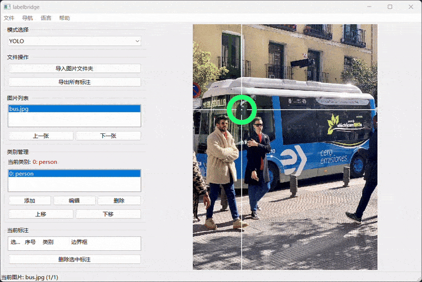
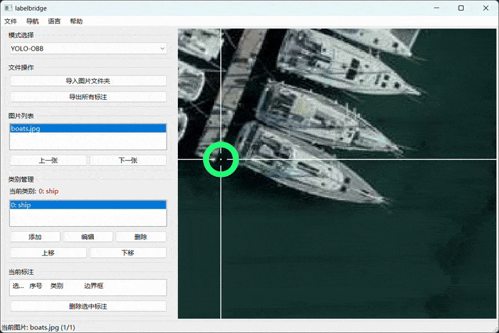

# **LabelBridge – 轻量级 YOLO / YOLO-OBB 标注工具（基于 wxPython）**

[English](README.md) | 简体中文

---

## 🚀 简介

**LabelBridge** 是一款基于 **wxPython** 开发的简洁、轻量且易于使用的图像标注工具。
它同时支持 **YOLO** 和 **YOLO-OBB（定向边界框）** 格式，并针对流畅的图像浏览、类别管理和标注操作进行了优化。

该工具设计简洁、运行快速、操作直观，无需复杂的安装过程，也无繁重的依赖项。

---

## ✨ 功能特点

* ✔️ 支持 YOLO 与 YOLO-OBB 标注格式
* ✔️ 流畅的图像浏览（支持键盘切图）
* ✔️ 简洁快速的标注新增/选择/删除操作
* ✔️ 类别管理：新增、编辑、删除、排序

---

## 📦 安装方法

### 1.安装依赖

```
pip install wxPython numpy
```

### 2.运行程序

```
python labelbridge.py
```

---

## 🖼️ 使用说明

### 1. 导入图片文件夹

点击「加载文件夹」，选择包含图片的目录。
> 工具会自动识别 `.jpg`、`.png` 等常见格式，并加载同名 `.txt` 标注文件（如有）。

### 2. 类别管理

在左侧「类别管理」区域：

- **添加**：点击「新增类别」输入名称
- **编辑/删除/排序**：选中类别后操作

> 修改类别顺序后，所有标注文件中的类别 ID 会自动重映射并保存。

### 3. 选择当前类别

在类别列表中单击选择一个类别，该类别将用于后续新建的标注框。

### 4. 图像标注

#### • 普通矩形框（YOLO 模式）

- **创建**：左键拖拽绘制新框
- **选择**：单击已有框
- **移动**：拖拽选中框
- **调整大小**：拖拽框角/边上的手柄



#### • 旋转矩形框（YOLO-OBB 模式）

- **创建**：左键拖拽（初始为水平框）
- **旋转**：
    - **右键拖动（推荐）**：实时调整辅助十字线角度
    - **Z / X / C / V 键**：也可调整辅助十字线角度
- 其他操作（移动、缩放、选择）与普通框一致



### 5. 图像导航

- **左右方向键**：切换上/下一张图片
- **左侧图片列表**：直接点击跳转任意图片

### 6. 标注编辑

- **Delete 键**：删除当前选中的标注
- **ESC 键**：取消当前选中状态

### 7. 视图控制

- **中键拖动**：平移图像
- **Ctrl + 鼠标滚轮**：以鼠标位置为中心缩放

### 8. 保存标注

- **自动保存**：切换图片时自动保存当前标注
- **手动导出**：点击「导出全部」按钮，同时生成 `classes.txt`

---

## ⌨️ 快捷键

| 按键       | 功能    |
|----------|-------|
| Ctrl + O | 打开文件夹 |
| Ctrl + S | 保存标注  |
| 左方向键     | 上一张   |
| 右方向键     | 下一张   |
| Ctrl + Q | 退出    |

---

## 🤝 贡献

欢迎提交 PR 或 Issue！

---

## 📄 开源协议

Apache-2.0 license。
